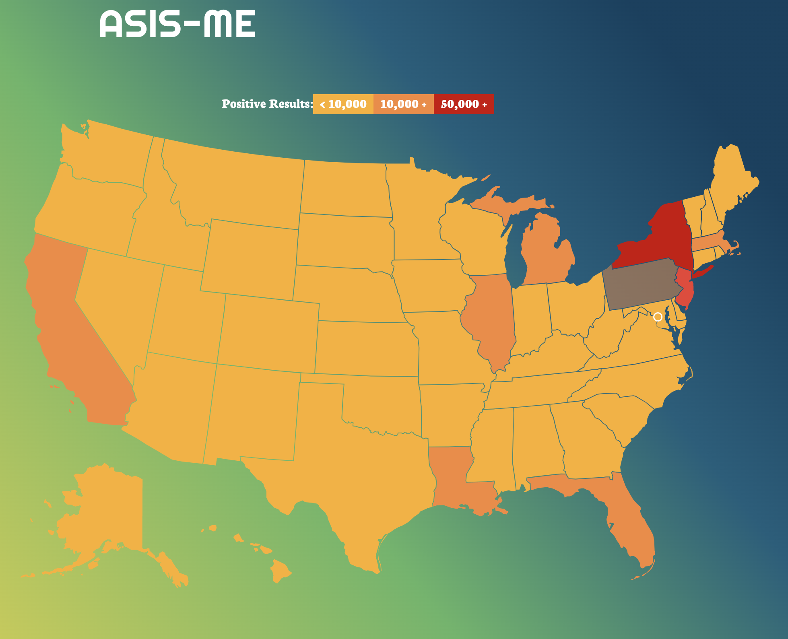
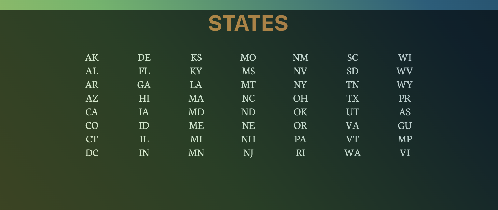
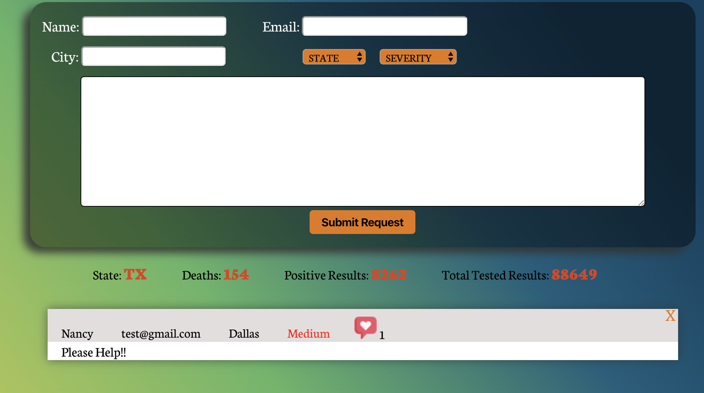

## Asis-Me
User will be able to see statistics for COVID-19 by clicking on **their** state. They can ask/send assistance from display page.

## Motivation
We would wanted to be able to help others gather information and be able to request assistance during this global pandemic.

## Code style
A working full-stack application, built by us, using the MERN stack: **Mongoose, Express, React, and Node.js and full CRUD**.

## Link to Back-End
https://github.com/leeanneahammond/project_three_backend

## Deployed on:
Heroku
https://asis-me.herokuapp.com/

### Trello:
https://trello.com/b/SS0ZiVXG/project-3-mern-stack-assisme

 
## Screenshots

## Tech/framework used

<b>Built with</b>
- [Mongoose](https://mongoosejs.com/)
- [Express](https://expressjs.com/)
- [React](https://reactjs.org/)
- [Node.js](https://nodejs.org/)

## Features
Bringing in different components and wiring them together to get them to work with each other. 

## Installation
Clone and then **npm i** to install new modlules. 

## API Reference

We used [COVID Tracking](https://covidtracking.com/api/states)

## Credits
- Phil Huynh --> Front End Manager  
- Chris Murphy -- Product Manager  
- Leeanne Hammond --> Release Manager  
- Nancy --> Back End Manager  

